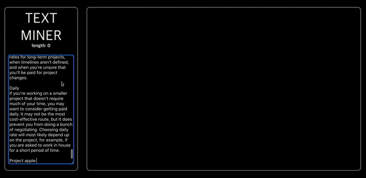

# 텍스트 분석 어플리케이션

텍스트를 입력받아 각 단어의 빈도수 분석해 시각적으로 표현해 주는 텍스트 분석 애플리케이션입니다.



## Setup

Install dependencies

```sh
$ yarn install (or npm install)
```

## Development

```sh
$ yarn dev (or npm run dev)
# visit http://localhost:8080
```

- HTML 수정: `index.ejs`를 수정하시면 됩니다.
- JS 수정: `/app/index.js`를 수정하시면 됩니다.
- CSS 수정: `/assets/styles/index.less`를 수정하시면 됩니다. (파일 형식을 `.scss`로 바꿔서 SCSS를 사용하여도 됩니다.)

## Features

- [ ] 사용자가 텍스트를 입력할 수 있는 칸이 있습니다. (영문만 지원)
- [ ] 사용자는 5000자(영문 기준)이하로 텍스트를 입력할 수 있습니다.
- [ ] 텍스트가 5000자를 초과했을 경우, 사용자에게 글자수 초과에 대한 정보를 알려주고 텍스트 분석은 하지 않습니다.
- [ ] 텍스트가 5000자를 초과하지 않았을 경우, 사용자에게 텍스트 분석 결과를 보여줍니다.
- [ ] 사용자가 텍스트를 수정할 경우, 수정하는 동시에 분석 결과에 반영됩니다.
- [ ] 사용자가 입력한 텍스트에서 사용된 **단어**들을 추출하여 분석 합니다. 중복되는 경우는 하나로 처리합니다.
- [ ] **추출한 단어들의 횟수**를 분석하여 사용자에게 보여줍니다.
